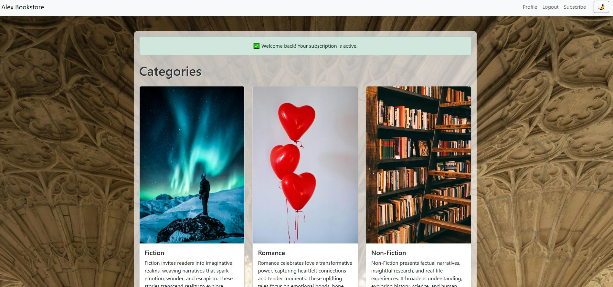
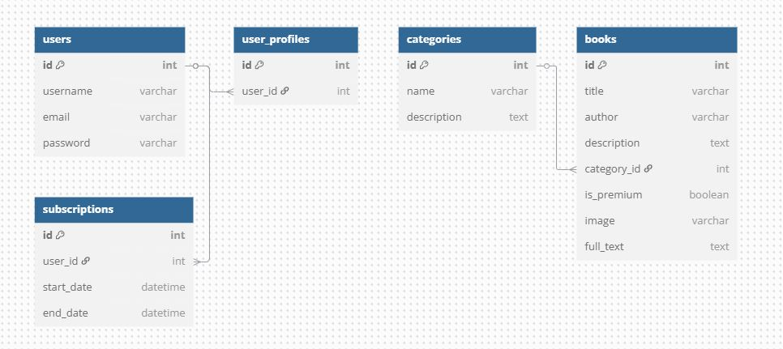
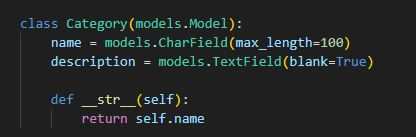
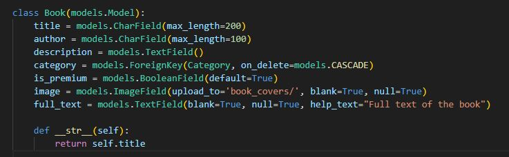
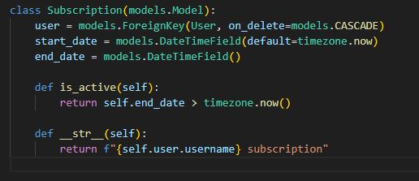

# Alex Bookstore
https://alex-bookstore-6dcd2c22e5a6.herokuapp.com/
Author: Aleksandar Husagic

  

## Table of Contents

- [Project Overview](#project-overview)  
- [Features](#features)  
- [Technologies Used](#technologies-used)  
- [Installation](#installation)  
- [Deployment](#deployment)  
- [Database and Data Structure](#database-and-data-structure)  
- [Manual Testing](#manual-testing)      
- [Environment Variables](#environment-variables)   
- [Future Improvements](#future-improvements)   
---

## Project Overview

Alex Bookstore is a subscription-based web application built with Django that allows users to browse, read, and manage a collection of books categorized by genres. Premium content access is restricted to subscribed users. The application is deployed on Heroku, uses PostgreSQL as the database, and manages media files such as book covers using AWS S3.

---

## Features

- User registration and authentication  
- Subscription management with access control  
- Book browsing by categories  
- Support for free and premium books  
- Admin interface for content and user management  
- Responsive UI with Bootstrap  
- Cloud deployment on Heroku with AWS S3 media storage  

---

## Technologies Used

- Python 3.13 – The main programming language used to build the backend of the web application.
- Django 5.1 – A Python web framework used to create the full-stack web app, including models, views, templates, and admin features.
- PostgreSQL – A powerful relational database used to store all data such as users, books, categories, and subscriptions. 
- AWS S3 (Amazon Web Services) – Used to store and deliver uploaded book cover images in production.  
- Heroku – The platform used to deploy the live version of the application online. 
- Bootstrap 5 – A CSS framework used to style the website and make it responsive and user-friendly. 
- Gunicorn – A Python WSGI HTTP server used with Heroku to serve the Django app in production.  
- Whitenoise – Used to serve static files (like CSS and JS) directly from the Django app without needing a separate server. 
- HTML/CSS/JavaScript – Used in the frontend for page structure, styling, and adding interactivity (like light/dark mode).
- Git & GitHub – Used for version control and collaboration. The project code was regularly pushed to GitHub for backup and deployment.
- Stripe – Integrated for handling subscription payments securely.
- Visual Studio Code – My primary code editor used throughout the project.

---

## Installation

### Prerequisites

- Python 3.13+  
- PostgreSQL  
- AWS account with S3 bucket setup  

### Setup Instructions

1. Clone the repository  
2. Create and activate a virtual environment  
3. Install dependencies via `pip install -r requirements.txt`  
4. Configure environment variables (see [Environment Variables](#environment-variables))  
5. Run database migrations  
6. Create a superuser  
7. Collect static files  
8. Run the development server  

---

## Deployment

Deployment is done on Heroku with the following steps:

1. Login to Heroku CLI  
2. Create or use an existing Heroku app  
3. Set required environment variables on Heroku  
4. Push the code to Heroku’s Git remote  
5. Run migrations on Heroku  
6. Access the live app via the Heroku URL  

---

## Database and Data Structure

### Database System

- The project uses **PostgreSQL**, a robust relational database system, to store all data persistently.

### Django Models and Relationships

The database schema is represented by the following Django models and their relations:

#### 1. **Category**

- Stores book categories or genres.
- Fields:
  - `id`: Primary key (auto-generated)  
  - `name`: String, name of the category  
  - `description`: Text, optional description  

#### 2. **Book**

- Stores books with metadata and content.
- Fields:
  - `id`: Primary key  
  - `title`: String, book title  
  - `author`: String, author’s name  
  - `description`: Text, book synopsis  
  - `category`: ForeignKey to Category (one-to-many)  
  - `is_premium`: Boolean, if the book requires subscription  
  - `image`: ImageField, book cover stored on AWS S3  
  - `full_text`: TextField, full book content (optional)  

#### 3. **UserProfile**

- Fields:
  - `user`: OneToOneField to User   

#### 4. **Subscription**

- Manages user subscription periods.
- Fields:
  - `user`: ForeignKey to User (one user can have multiple subscriptions)  
  - `start_date`: DateTimeField, subscription start  
  - `end_date`: DateTimeField, subscription end  

### Relationships Overview

| Model       | Relationship          | Related Model | Cardinality     |
|-------------|-----------------------|---------------|-----------------|
| Book        | ForeignKey (category) | Category      | Many books to one category |
| UserProfile | OneToOneField (user)  | User          | One-to-one      |
| Subscription| ForeignKey (user)     | User          | Many subscriptions to one user |

### Entity-Relationship Diagram (ERD)

The following ERD was generated using dbdiagram.io and illustrates the structure of the project’s PostgreSQL database, including all model relationships.

---

## Manual Testing

| **Area**            | **Test Case**          | **Steps**                                                        | **Expected Result**                                            |
|---------------------|-----------------------|-----------------------------------------------------------------|---------------------------------------------------------------|
| Home Page           | Load Home             | 1. Go to `/`                                                    | Hero banner, categories displayed, navbar links visible.      |
| Navigation          | Nav Links             | 1. Click Profile, Logout, Subscribe, Login/Register (if not logged in) | Correct pages load; active nav link highlights.               |
| Categories          | Category List          | 1. Go to Home 2. Click on a Category                         | Category page shows correct books in that category.           |
| Book Detail         | View Book              | 1. From Category or Home, click a book title                    | Book details show correctly; premium books restrict access if no subscription. |
| Register            | New User               | 1. Go to `/register` 2. Fill valid form data 3. Submit   | Success message; redirects to login page.                     |
| Register            | Duplicate Username     | 1. Attempt to register with existing username                   | Error message: "Username already taken."                       |
| Login               | Valid Credentials      | 1. Go to `/login` 2. Enter valid username and password 3. Submit | Redirect to Home with welcome message and updated navbar.     |
| Login               | Invalid Credentials    | 1. Go to `/login` 2. Enter wrong password                   | Error message displayed, login page remains.                  |
| Logout              | Logout User            | 1. Click Logout link                                            | User logged out; redirected to login or home page.            |
| Subscription        | Subscribe User         | 1. Click Subscribe 2. Enter payment info 3. Submit       | Success message; subscription active status updated.          |
| Subscription        | Cancel Subscription    | 1. Go to `/subscriptions/cancel` 2. Confirm cancellation    | Subscription cancelled; user notified.                         |
| Subscription        | Access Premium Content | 1. Login without active subscription 2. Attempt to read premium book | Redirect to subscription page with warning message.           |
| Book Reading        | Read Book              | 1. Login with subscription 2. Open premium book             | Book content displays without restriction.                    |
| Responsive Design   | Mobile View            | 1. Resize browser to < 768px or use device emulator             | Navbar collapses; content adjusts responsively.               |
| Messages            | Flash Messages         | 1. Register, login, subscribe, logout, submit forms            | Appropriate success/error messages displayed consistently.    |
| Error Handling      | Invalid Book ID        | 1. Visit `/book/<invalid_id>`                                  | "Book not found" or 404 error page shown.                      |
| Profile Management  | View Profile           | 1. Login 2. Visit profile page                               | User info and subscription status displayed correctly.        |
| Profile Management  | Update Profile         | 1. Edit profile details 2. Submit                            | Profile updates saved; success message displayed.             |

### Subscription and Payment Flow
#### Subscription Process:
Log in and click the "Subscribe" button.
On the subscription page, use Stripe’s test card number 4242 4242 4242 4242 with any valid future expiration date and any 3-digit CVC to simulate payment.
Confirm that after a successful payment, you see a success message and that your subscription status is updated on your profile.

*************

## Structured layout:
Alex Bookstore features a clean, responsive layout with a persistent header and navigation bar. The home page presents a carousel highlighting featured books, followed by organized sections for categories and recent books. Each category page displays an overlay with a category image, description, and a list of related books, while individual book detail pages showcase cover images, book details, and a premium “Read Full Text” option for subscribers. Additionally, the site includes user authentication pages, subscription flows via Stripe, and an admin panel for managing content. The design, built with Bootstrap 5, ensures intuitive navigation and a consistent experience across devices.

#### Responsive Design:
Resize the browser window (or use browser developer tools) to ensure that the categories and their images adjust appropriately across various screen sizes.

#### Prevent Duplicate Subscriptions:
Try clicking the subscribe button again while your subscription is active.
Verify that the system informs you that you are already subscribed (or simply prevents duplicate subscriptions).

#### Media File Checks:
Use browser developer tools to verify that all media files (especially book cover images) load correctly and that there are no 404 errors.

## Original custom Django models

#### 1. 📘 Category Model

- **Purpose**:  
  The `Category` model allows books to be grouped by genre or topic. It enhances user experience by organizing content into browseable sections.

- **Fields**:  
  - `id`: Auto-generated primary key  
  - `name`: CharField – the name of the category  
  - `description`: TextField – optional description text  

- **Defined in**: `books/models.py`

---

#### 2. 📚 Book Model

- **Purpose**:  
  The `Book` model is the core of the app, storing all metadata related to each book. It includes whether the book is premium, linking it to user subscription logic.

- **Fields**:  
  - `id`: Auto-generated primary key  
  - `title`: CharField – title of the book  
  - `author`: CharField – author's name  
  - `description`: TextField – synopsis  
  - `category`: ForeignKey – links to a Category  
  - `is_premium`: Boolean – indicates if a subscription is required  
  - `image`: ImageField – cover image stored on AWS S3  
  - `full_text`: TextField – optional full book content  

- **Defined in**: `books/models.py`

---

#### 3. 💳 Subscription Model

- **Purpose**:  
  The `Subscription` model manages premium access by tracking a user’s subscription period. It integrates with the business logic for showing/hiding premium content.

- **Fields**:  
  - `user`: ForeignKey – links to Django’s built-in `User` model  
  - `start_date`: DateTimeField – subscription start  
  - `end_date`: DateTimeField – subscription end  

- **Defined in**: `subscriptions/models.py`

---

These models were not inherited or prebuilt—they were entirely custom-designed for this project.